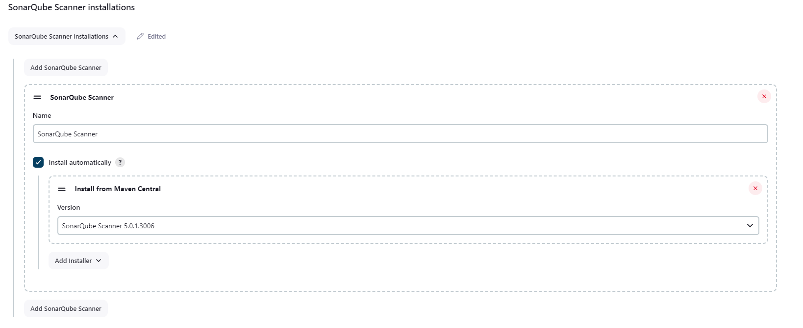
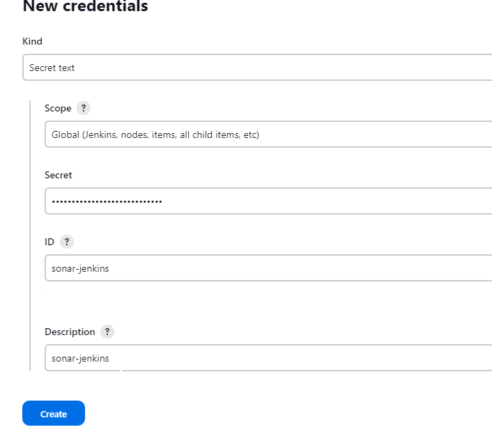
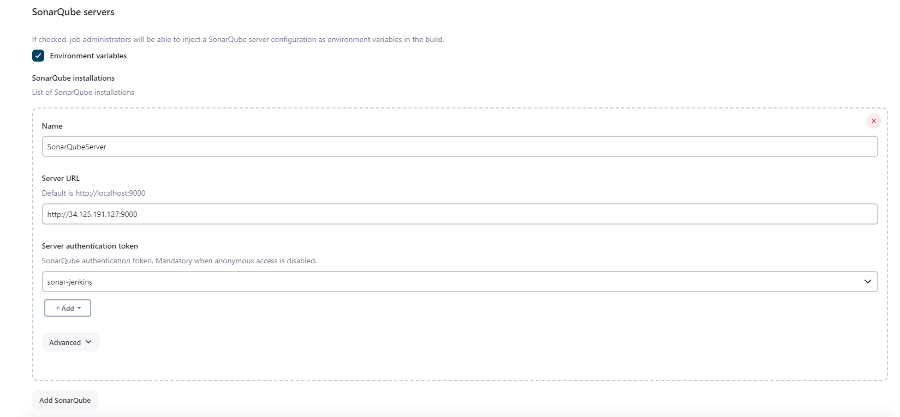
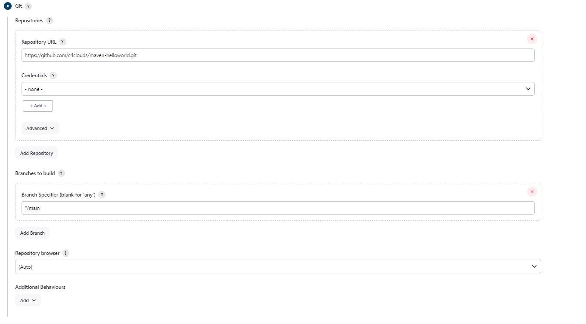
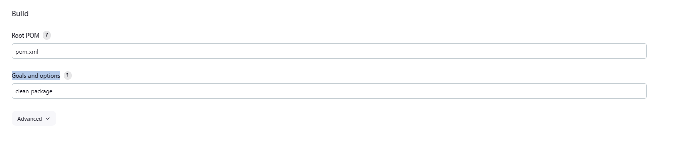
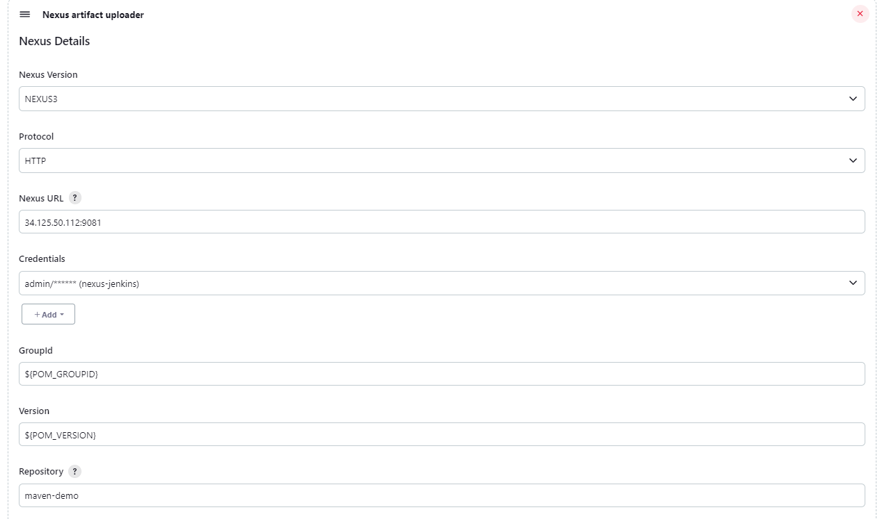
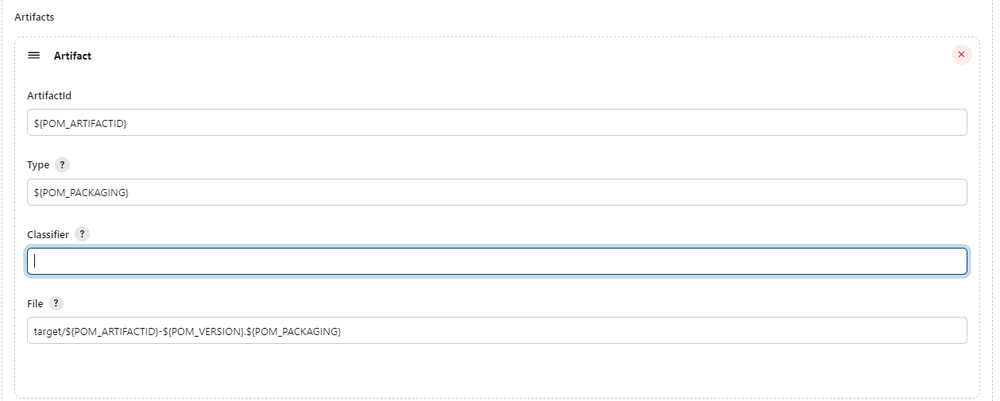

# In this tutorials we are going to learn
 * How to install SonarScanner plugin, nexus and slicing plugins
 * How to configure SonarScanner
 * How to scan you project
 * How to execute maven build
 * How to configure nexus plugin and upload artifact to nexus

 ## How to install SonarScanner plugin
1. Login to Jenkins --> Manage Jenkins --> Plugins. Now in the Search box type "SonarQube Scanner for Jenkins", "Nexus Artifact Uploader", "Configuration Slicing plugin"   and click on install button to install th plugin.

## How to configure SonarScanner
1. To configure the SonarScanner go to  Jenkins --> Manage Jenkins --> Tools --> SonarQube Scanner installations
2. Provide a name to SonarQube Scanner --> apply -->save



3. Now we need to provide Sonar Server details like Sonar Host URL and Sonar Token for Authentication. To do so, go to Jenkins --> Manage Jenkins --> Credentials --> Add Credentials --> on Kind select Secret text. Provide your sonar token in Secret box, provide id and Description.



4. To provide Sonar host URL go to Jenkins --> Manage Jenkins --> System --> SonarQube Server
Provide a name, provide server URl and select "server authentication token" that you have already configured in the previous step. now click on Apply --> Save



## How to scan you project
1. Create a new job "mvn-sonar-jenkins" job should be maven project. On "Source Code Management" select git and provide the github project url as "https://github.com/c4clouds/maven-helloworld.git"

note: branch is main not master for the above github repo



2. In the Pre Steps click on Add-pre-build step --> Execute SonarQube Scanner. In the Analysis properties provide the below inputs and click on apply and save.

```
sonar.projectKey=demo
sonar.projectName=demo
sonar.projectVersion=1.0
sonar.sources=.
```

Note: Make sure to create a project called "demo" in Sonar to make the build success.

## How to execute maven build
On the Build steps define  "clean package" in Goals and Options



## How to configure nexus plugin and upload artifact to nexus
In your sonar-jenkins job click on configure button. On Post Steps click on Add post-build step --> Nexus artifact Uploader.
Now set the Nexus version to NEXUS3, Protocol to HTTP provide Nexus Host URL and add your nexus Login Credentials for authentication. 

--
GroupId: ${POM_GROUPID},

Version: ${POM_VERSION},

ArtifactId: ${POM_ARTIFACTID},

Type: ${POM_PACKAGING},

File: target/${POM_ARTIFACTID}-${POM_VERSION}.${POM_PACKAGING}
--

in the GroupId mention ${POM_GROUPID}, Version as ${POM_VERSION}, Repository as "maven-demo".

Now click on add to add Artifacts details

ArtifactId as ${POM_ARTIFACTID}, Type as ${POM_PACKAGING}, File as target/${POM_ARTIFACTID}-${POM_VERSION}.${POM_PACKAGING}





Now click on apply and save.

